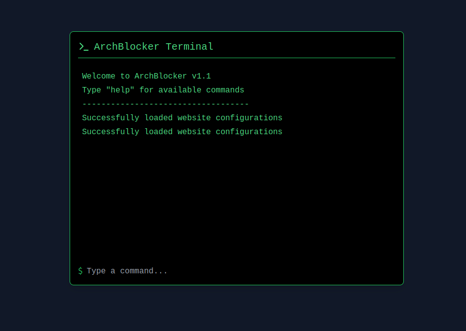

<div style="display: flex; justify-content: center;">
    
</div>

# ArchWebBlocker

A powerful website blocker application with a retro terminal interface for Linux systems, designed to help you manage digital distractions and boost productivity.

<div style="display: flex; justify-content: center;">
    
</div>

## Features

- 🚫 Block websites during specified time periods
- ⏰ Set custom blocking schedules for each website
- ⏸️ Temporary pause blocking (up to 15 minutes, max 2 times per day)
- 🖥️ Retro terminal-style interface
- 🔒 System-level blocking using hosts file
- 🔄 Real-time updates and monitoring

## Prerequisites

- Linux operating system
- Python 3.6+
- Node.js 14+
- Root access (for modifying hosts file)

## Installation

1. Clone the repository:
```bash
git clone https://github.com/Andebugulin/ArchWebBlocker.git
cd ArchWebBlocker
```

2. Set up the backend:
```bash
cd backend
pip install -r requirements.txt
```

3. Set up the frontend:
```bash
cd frontend
npm install
```

## Running the Application

1. Start the backend server (requires root privileges):
```bash
sudo python3 archblocker.py
```

2. Start the frontend development server:
```bash
cd frontend
npm run dev
```

3. Open your browser and navigate to `http://localhost:5173`

## Usage

The application provides a terminal-style interface with the following commands:

- `add <website> <startTime> <endTime>` - Add a website to block
  - Example: `add facebook.com 09:00 17:00`

- `remove <website>` - Remove a website from blocking
  - Example: `remove facebook.com`

- `pause <website> [minutes]` - Temporarily pause blocking
  - Example: `pause instagram.com 5`

- `list` - Show all blocked websites
- `refresh` - Refresh website list
- `status` - Check service status
- `clear` - Clear terminal
- `help` - Show available commands

## Creating a System Service

To ensure ArchBlocker runs automatically on system startup, you can create a systemd service:

1. Create a service file:
```bash
sudo nano /etc/systemd/system/archblocker.service
```

2. Add the following content:
```ini
[Unit]
Description=ArchBlocker Website Blocker
After=network.target

[Service]
Type=simple
User=root
ExecStart=/usr/bin/python3 /path/to/your/archblocker.py
Restart=always
RestartSec=10

[Install]
WantedBy=multi-user.target
```

3. Enable and start the service:
```bash
sudo systemctl daemon-reload
sudo systemctl enable archblocker
sudo systemctl start archblocker
```

4. Check service status:
```bash
sudo systemctl status archblocker
```

5. View logs:
```bash
sudo journalctl -u archblocker -f
```

## Technical Details

### Backend (`archblocker.py`)
- Built with Flask and Python
- Manages the hosts file for system-level website blocking
- Implements pause functionality with daily limits
- Includes rotating log system for debugging

### Frontend (`App.jsx`)
- Built with React and Vite
- Uses Tailwind CSS for styling
- Features a terminal-style interface using Lucide React icons
- Real-time communication with backend API

## Security Considerations

- The application requires root privileges to modify the hosts file
- The API server runs on localhost only
- Uses file immutability protection for the hosts file
- Implements input validation for all commands

## Limitations

- Only works on Linux systems
- Requires root access
- Blocking can be bypassed by clearing DNS cache

## Contributing

Contributions are welcome! Please feel free to submit a Pull Request.

## License

This project is unlicensed
